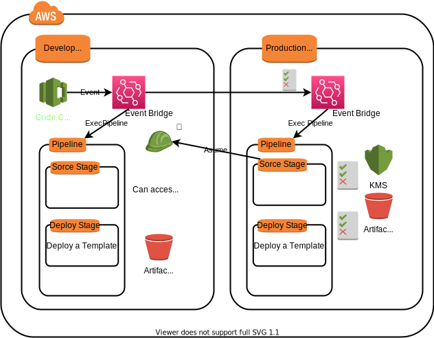

# AWS Cross Account Pipeline Event Bridge Base

## 構成図（簡略）

## 記事  
https://zenn.dev/thor/articles/8aee471bf85660

## パラメータ一覧

- deploy_template1.yml
  - RepositoryAccountId  
    開発環境のアカウントID
  - RepositoryName  
    テンプレートを保存するリポジトリ名
  - ProductionPipelineArtifactsBucketName  
    本番パイプラインで使用するバケット名

 

- deploy_template2.yml
  - ProductionAccountId  
  本番環境のアカウントID
  - ProductionArtifactS3BucketARN  
  deploy_template1.ymlで作成した本番環境のS3のARN
  - CmkARN  
  deploy_template1.ymlで作成した本番環境のKMSのARN
  - RepositoryName  
  テンプレートを保存するリポジトリ名
  - TargetEventBusName  
  deploy_template3.ymlで作成する予定のカスタムイベントバスの名前
  - DevelopPipelineArtifactsBucketName  
  開発パイプラインで使用するバケット名
  - DeployStackName   
  開発環境でのスタック名
  - DevelopPipelineName  
  開発環境のパイプラインの名前
  - ApprovalTopicAddress  
  開発環境パイプラインの手動承認EmailAddress
  - ApprovalTopicName  
  開発環境パイプラインの手動承認トピック名

 

- deploy_template3.yml
  - ArtifactBucketName  
  本番パイプラインで使用するバケット名
  - CmkArn  
  deploy_template1.ymlで作成した本番環境のKMSのARN
  - PipelineRoleArn  
  deploy_template1.ymlで作成した本番環境のパイプラインロールのARN
  - CodeCommitRoleArn  
  deploy_template2.ymlで作成したクロスアカウントアクセス用ロールのARN
  - RepositoryName  
  テンプレートを保存するリポジトリ名
  - DevelopAccountId  
  開発環境のアカウントID
  - DeployStackName  
  本番環境でのスタック名
  - ProductionPipelineName  
  本番環境のパイプラインの名前
  - ApprovalTopicName  
  本番環境パイプラインの手動承認トピック名
  - ApprovalTopicAddress  
  本番環境パイプラインの手動承認EmailAddress
  - CustomEventBusName  
  deploy_template2.ymlで設定したカスタムイベントバスの名前